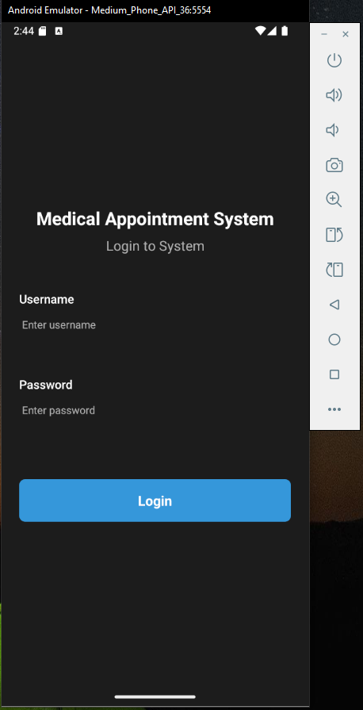
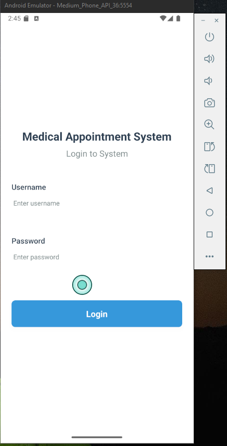
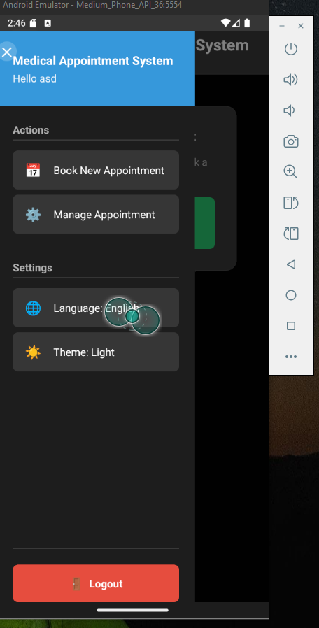
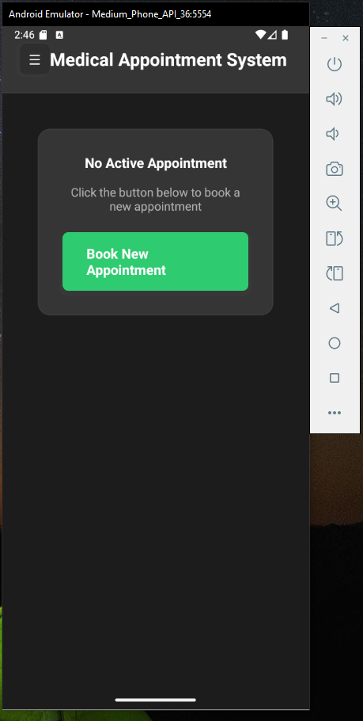
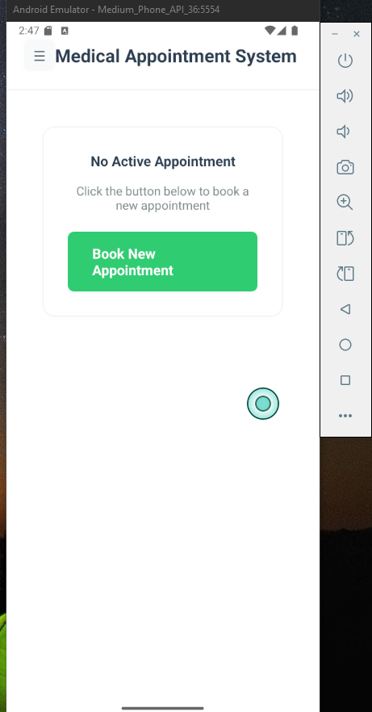
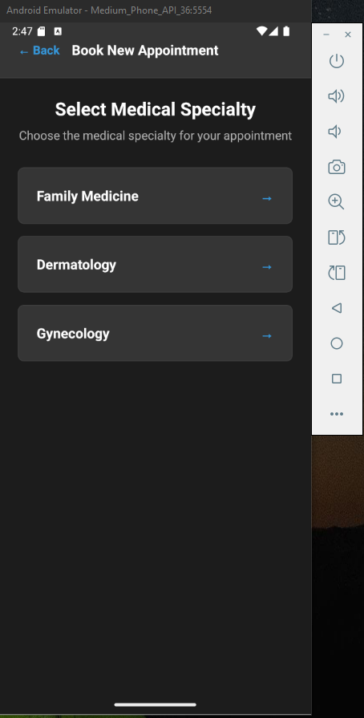
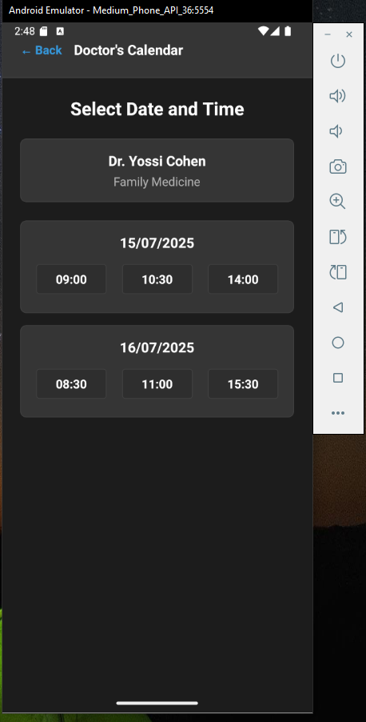
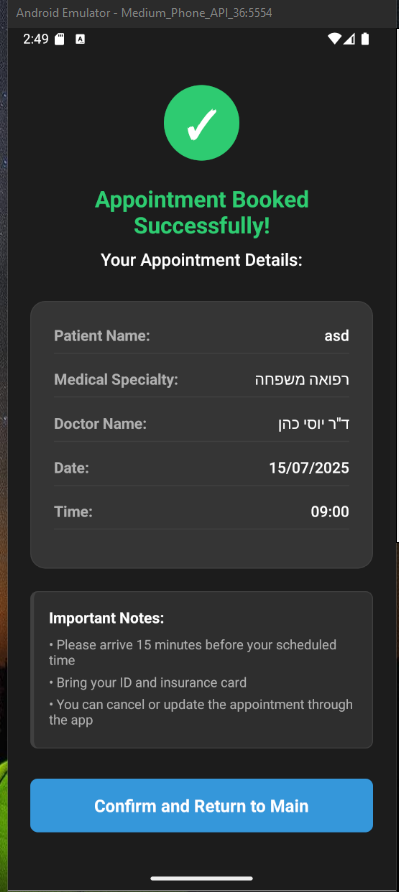

# 📱 Clalit Appointment Scheduler

This is a mobile application built with **React Native** using **Expo CLI**.  
The app is designed to manage appointment scheduling for Clalit healthcare services.

---

## 🌗 Theme Support

The app supports both **light** and **dark mode**.  
The UI automatically adapts based on the user's system preferences or manual theme selection via context and theme hooks.

---

## 🌍 Multilingual Support

This project is fully **internationalized** and currently supports:

- 🇺🇸 **English**
- 🇮🇱 **Hebrew**

Translations are managed using the `translations/` directory and accessed via the custom `useTranslation` hook.  
Adding additional languages is straightforward – simply extend the translation files and update the logic in the hook.

## 🚀 Getting Started

### 1. 📦 Clone the repository

```bash
git clone https://github.com/YOUR_USERNAME/clalit-appointment-scheduler.git
cd clalit-appointment-scheduler
```

### 2. 📥 Install dependencies

```bash
npm install
```

### 3. ▶ Start the development server

```bash
npx expo start
```

> You can also run:  
> `npm run start` – opens the Expo DevTools in the browser.

---

## 📱 Running the app

### ✅ On your mobile device

1. Install the [Expo Go](https://expo.dev/client) app from the App Store or Google Play.
2. Scan the QR code from the terminal or Expo DevTools.

### 🖥️ On Android Emulator

```bash
npm run android
```

### 🍏 On iOS Simulator (Mac only)

```bash
npm run ios
```

---

## 🗂 Folder Structure

```
clalit-appointment-scheduler/
├── .expo/                  # Expo system files
├── assets/                 # App assets (images, icons, fonts)
├── components/             # Reusable UI components
├── constants/              # Constant values used in the app
├── contexts/               # React context (e.g., ThemeContext)
├── hooks/                  # Custom hooks (e.g., useTheme, useTranslation)
├── navigation/             # Navigation configuration (AppNavigator)
├── redux/                  # Redux store and slices
├── screens/                # All app screens
├── services/               # API or logic services
├── theme/                  # Theme-related files
├── translations/           # Translation files (i18n)
├── types/                  # TypeScript types
├── utils/                  # Utility functions (e.g., storage, mockData)
├── App.tsx                 # App entry point
├── app.json                # Expo config
├── index.ts                # App bootstrapper
├── package.json            # Project metadata and dependencies
├── tsconfig.json           # TypeScript config
└── README.md               # You're reading it 😉
```

---

## 🔧 Useful Commands

| Command           | Description                         |
| ----------------- | ----------------------------------- |
| `npm start`       | Start the dev server (Expo)         |
| `npm run android` | Run app on Android emulator/device  |
| `npm run ios`     | Run app on iOS simulator (Mac only) |
| `npm run web`     | Run app in browser (web version)    |

---

## 🧑‍💻 Author

Arkadi Ziv  
[Your GitHub Profile](https://github.com/arkadiyz/)

---

## 📄 License

This project is licensed under the MIT License.
















